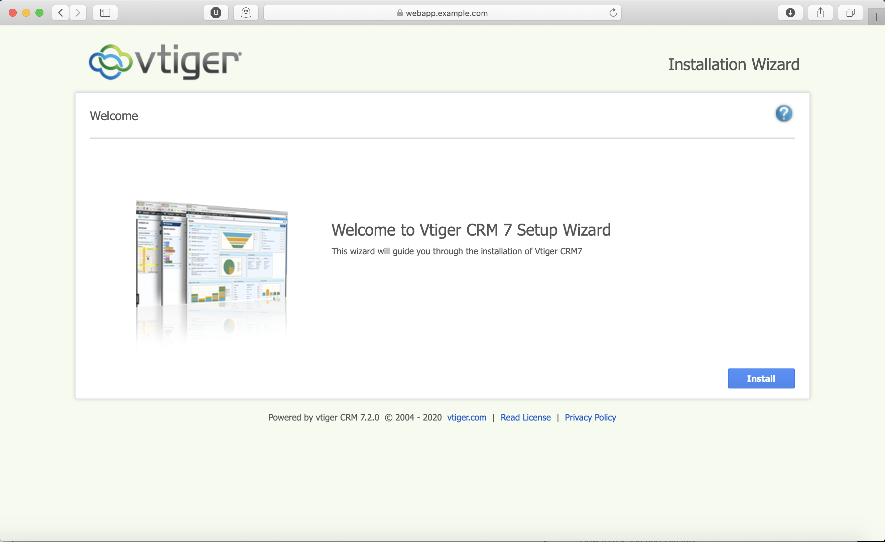

# Deployment of Vtiger CRM application

Vtiger CRM enables sales, support, and marketing teams to organize and collaborate to measurably improve customer experiences and business outcomes. For more info visit https://www.vtiger.com/sales-crm

This project focuses on deploying Vtiger CRM application into production like environment where this ansible playbook will automate configuration of storage, web and database server.

Storage server contains two LVs of 10GB each in which one LV is shared as NFS share to web server for storing Vtiger CRM application data i.e.website pages and second LV is shared as iSCSI storage to database server for storing MYSQL database tables i.e. Customer's data.

Note: This playbook is tested on CentOS operating system

### Requirements

1. Sudo user "devops" should be present on all servers. Ensure that /etc/sudoers file have this line present
   
   devops ALL=(ALL) NOPASSWD: ALL
   
2. This playbook does not create any disks/partitions/LVs. It is expected that they are already present on machine. They are defined by these variables where volume group name = storage and logical volume names are webapp and database 

    webapp_storage: /dev/storage/webapp  
    database_storage: /dev/storage/database
    
## Output

When ansible playbook complete all its tasks then run this command on your local machine 
$ echo "<Webserver_IP_address>  webapp.example.com" >> /etc/hosts  

Then goto your web browser and type webapp.example.com in URL section   

